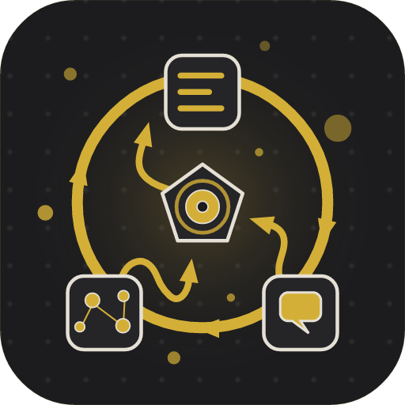
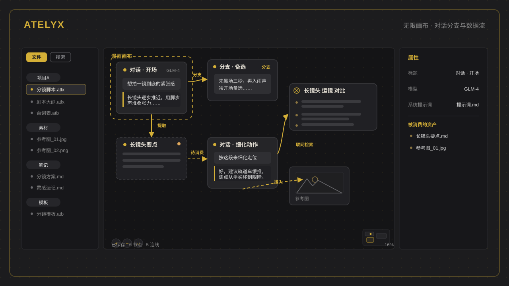
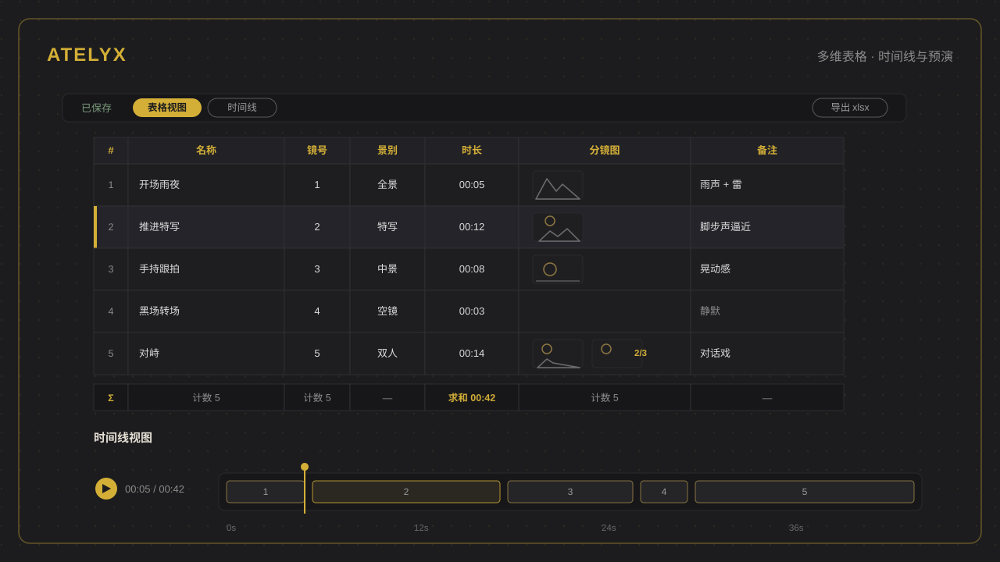
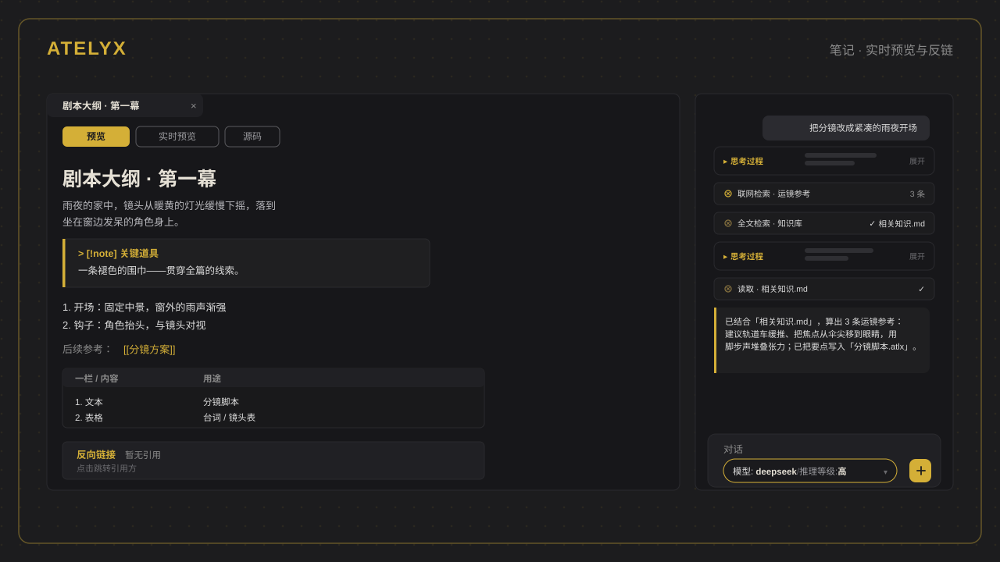
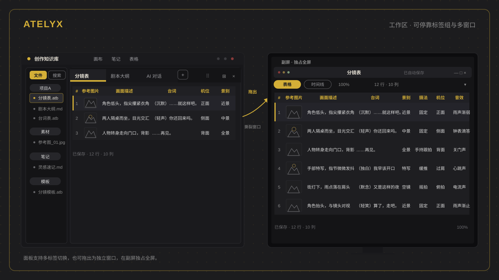

<div align="center" style="padding:4px 0 12px">

[简体中文 →](../README.md)

</div>

<div align="center" style="background:#17171a;border:1px solid #2a2a2e;border-radius:16px;padding:48px 24px 40px;margin:0 0 32px">



<h1 style="color:#E5E0D5;font-weight:700;letter-spacing:3px;margin:16px 0 10px">ATELYX</h1>

<p style="color:#D4AF37;font-size:17px;font-weight:600;margin:0 0 14px">Conversation is no longer linear — it is a directed graph on an infinite canvas</p>

<p style="color:#8b8b8b;max-width:660px;margin:0 auto 30px;font-size:15px;line-height:1.8">
A human-first desktop creation workbench that unifies AI conversations, notes, knowledge, search, and tables into one directed graph. Edges are data flow, nodes are reusable assets — thinking should never be interrupted.
</p>

<span style="background:#D4AF37;color:#1C1C1E;border-radius:999px;padding:4px 18px;font-size:13px;font-weight:700;margin:0 4px">Windows</span>
<span style="border:1px solid #5a5a5e;color:#9a9a9e;border-radius:999px;padding:3px 17px;font-size:13px;font-weight:600;margin:0 4px">Linux · target platform</span>
<span style="border:1px solid #5a5a5e;color:#9a9a9e;border-radius:999px;padding:3px 17px;font-size:13px;font-weight:600;margin:0 4px">Apache-2.0</span>

</div>

## Design Philosophy

A conversation with AI should not be a one-way timeline — once branches multiply, they become impossible to compare; context cannot be reused across conversations; materials are used and lost. Atelyx reorganizes all of this on an infinite canvas:

<div style="border:1px solid #2a2a2e;border-left:3px solid #D4AF37;border-radius:8px;padding:14px 20px;margin:14px 0">

**01 · Conversation is a directed graph, not a chat log** — every branch becomes a new node on the canvas, inheriting the full state of its parent and evolving independently. However many branches you explore, you can lay them side by side, compare paths, and see where each one leads.

**02 · Edges are data flow** — arrows point from producer to consumer; solid lines mean consumed, dashed lines mean pending. Data-flow edges cannot be manually disconnected — reference semantics are data semantics.

**03 · A reference is an edge, an edge is a reference** — typing `@` in the input box and dragging a line from a node's border are two ways of performing the same operation.

**04 · Artifacts become nodes** — web search results, pasted materials, and paragraphs distilled from a conversation automatically settle onto the canvas as reusable assets, connectable to any conversation.

**05 · Files are the vault** — there is no database. Canvases, notes, and attachments are plain files: accumulable, backup-able, Git-syncable, and openable in external editors with real-time sync back.

</div>

## Origin

The worst thing in creation is not the lack of inspiration — it is the interruption of thought. When writing a screenplay, your material lives in a writing app, the storyboard in a spreadsheet tool, and coordination switches back to a chat app — each step feels convenient on its own, yet every switch breaks your flow.

Atelyx started from exactly these switches. We wondered: if conversations, notes, materials, and tables all lived on one canvas, reachable and connectable at a glance, would your thinking survive the transitions? So Atelyx exists — it may not give you more ideas, but at least your thinking is never interrupted by tools.

## Core Concepts

```
+----------------+             +----------------+
| Conversation A | --branch--> | Conversation B |
+--------+-------+             +----------------+
         | extract: pull out a paragraph
         v
+----------------+
|   Text node    |
+--------+-------+
         | @ mention / drag-and-connect (dashed -> solid)
         v
+----------------+                    +----------------+
| Conversation C | --AI web search--> | Search results |
+--------+-------+                    +----------------+
         | feed: media node / table node
         v
   continue / branch again......
```

- **Conversation node** — multi-turn AI chat with streaming output, branching, and referenceable assets
- **Text node** — a paragraph distilled from a conversation; editable and re-usable as prompt context in any conversation
- **Media node** — images and files pasted or dragged in, injected as multimodal attachments
- **Search results node** — the artifact of the AI autonomously searching the web mid-conversation
- **Table node** — a reference to a vault table; a snapshot assembled by field name is injected on use
- **Group / Link node** — canvas organization and external URL cards

## Features

| | |
| --- | --- |
| **Infinite canvas · branching** | Conversations are canvas nodes, not timelines; branches inherit the full state of their parent and evolve independently, so any number of threads can be compared side by side |
| **Edges are data flow** | A reference is an edge: `@` mention and drag-and-connect are the same operation; solid = consumed, dashed = pending; artifacts are reusable across conversations |
| **Artifacts settle as nodes** | Web search results, pasted materials, and paragraphs distilled from a conversation automatically become reusable nodes, connectable to any conversation |
| **Note editor** | Live-preview editing; inline frontmatter properties; wiki links with quick-create for missing targets; auto-discovered backlinks |
| **Multi-dimensional table** | Typed fields and multi-image cells; timeline view with playback; AI-assisted row generation; xlsx export |
| **File-based vault** | No database, everything is files; notes openable in external editors with real-time sync; renames cascade across references and internal links |

## Interface Overview

<div align="center">









</div>

## Installation

Download the installer for your platform from [GitHub Releases](https://github.com/Xuhang944/Atelyx/releases):

| Platform | Package |
| --- | --- |
| Windows 10/11 (x64) | `.msi` / `.exe` |
| Linux (native Wayland, X11 compatible) | target platform — installers published after build validation |

Or build from source:

```bash
npm install         # install frontend dependencies
npm run tauri:dev   # start dev (Vite + Tauri window)
npm run tauri:build # build installers
```

Prerequisites: Node.js 18+, Rust (stable), Tauri 2 system dependencies (see [Tauri docs](https://v2.tauri.app/start/prerequisites/)).

## Vault Layout

A vault is a local folder of your choice. No database — everything is stored as files:

```
my-vault/
├── .atelyx/        vault-level config (hidden; API keys never land here — OS keychain)
├── project-a/
│   ├── canvas.atlx canvas file (one JSON per canvas)
│   ├── table.atb   table file
│   ├── prompt.md   note (openable in external editors)
│   └── assets/     attachments (images / files)
└── root-note.md    files at the root work too
```

- `.atlx` / `.md` / attachments are recognized by extension and may live in any folder (including the root)
- Text and media nodes store only path references — content stays in standalone files, shareable across canvases; deleting a canvas never deletes the files
- External edits to `.md` files, attachments, or canvases sync back to the app in real time

## Tech Stack

| Layer | Choice |
| --- | --- |
| Desktop shell | Tauri 2 (Rust backend, native Wayland) |
| Frontend | React 18 + TypeScript + Vite |
| Canvas | React Flow |
| State | Zustand |
| Styling | TailwindCSS + lucide-react |
| Markdown | react-markdown (GFM / syntax highlight / KaTeX / XSS-safe); CodeMirror 6 live-preview editing |
| Storage | File-based vault (no database) + `notify` real-time external-edit watching |
| AI | OpenAI-compatible providers, direct SSE streaming; API keys in the OS keychain |
| Search | Tavily API + self-hosted SearXNG |

## Development

```bash
npm run dev         # Vite dev server
npm run check       # typecheck + ESLint
npm run format      # Prettier
npm run tauri:dev   # start dev (Vite + Tauri window)
npm run tauri:build # build installers
```

## Privacy & Security

- **API keys live in the OS keychain by default** (isolated per vault) — never in vault files or logs; optional "save with vault" for multi-device sync
- Auto-update installers carry signature verification; invalid signatures are rejected

## Contributing

- Report bugs / request features: [Issues](https://github.com/Xuhang944/Atelyx/issues)
- Before submitting a pull request, please read [CONTRIBUTING.md](CONTRIBUTING.md) (Chinese)

## License

[Apache-2.0](../LICENSE)
